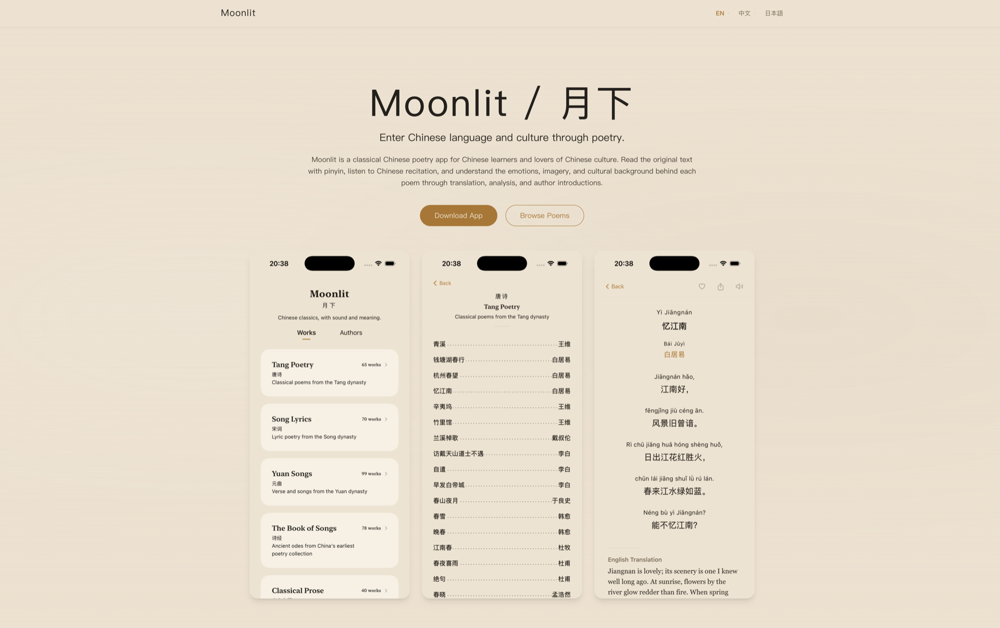

# Moonlit

**A quiet space for discovering, reading, and collecting Chinese poetry.**

Moonlit is designed around the experience of reading poetry.

It brings Chinese poetry into a calm, focused digital space — making it
easy to discover poems, explore poets, save favorites, and return to words
worth reading again.

## Discover Chinese Poetry

Explore poetry through different perspectives, including poems, poets,
themes, and curated selections.

Moonlit is designed not simply as a database of texts, but as a place for
serendipitous discovery.

## A Focused Reading Experience

Reading is at the center of Moonlit.

The interface is intentionally restrained, reducing unnecessary controls
and distractions so that typography, language, and the poem itself remain
the focus.

## Build Your Collection

Save poems you want to revisit and gradually build a personal collection
of poetry.

Moonlit is designed for both occasional discovery and long-term reading.

## Chinese Poetry & Culture

Moonlit focuses on Chinese poetry and the cultural context surrounding it.

The goal is to make poetry easier to encounter and appreciate through
modern digital design, while preserving the character and atmosphere of
the original works.

## Platforms

Moonlit is available on the web, iPhone, and iPad.

## Explore Moonlit

Visit Moonlit:

[Moonlit Website →](https://moonlitverse.com/)

[Version History →](CHANGELOG.md)

Download:

[Download Moonlit →](https://apps.apple.com/us/app/moonlit-verse/id6768858088?uo=4)

## Feedback & Issues

Feedback, bug reports, and feature suggestions are welcome.

If you've found a reproducible problem, please open a GitHub Issue and
include:

- Moonlit version
- Platform
- OS / browser version
- Description of the problem
- Steps to reproduce
- Expected behavior
- Actual behavior

For ideas, questions, and general discussion, please use GitHub Discussions.

## Source Code

Moonlit is proprietary software.

This repository is used for product information, releases, documentation,
issue tracking, and community discussions.

The application and website source code are not published here.

## License

Moonlit and its source code are proprietary software.

Copyright © Moonlit. All rights reserved.
